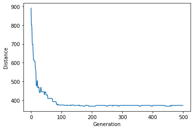
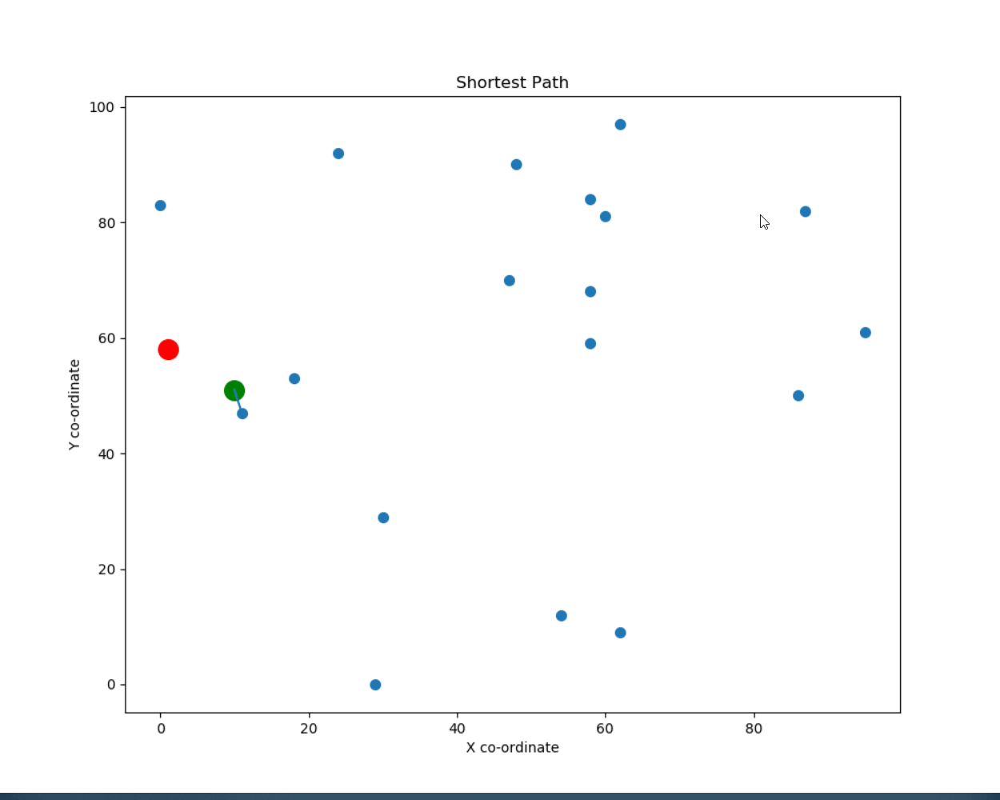

# Travelling Salesman Problem using Genetic Algorithm

### Installation

You can download it as zip or clone it using cmd
```sh
 git clone https://github.com/Inf1n8/TSP_GA.git
 cd TSA_GPA/
```

Make sure you have the package virtualenv if not then execute ```pip install virtualenv```
#### Create a virtual environment 
1) Windows
```sh
virtualenv venv
venv\Scripts\activate
```

2) Linux
```sh
virtualenv venv
source venv/bin/activate
```

#### Install necessary packages from requirements.txt

```sh
pip install -r requirements.txt
```

#### How to run

Parameters can be changed in ```config.json```
```
{
	"num_location" : 20,
	"elite_size" : 20,
	"num_generations" : 500,
	"population_size" : 100,
	"mutation_rate" : 0.01
}
```

If you want to run the jupyter notebook then type the following command in your terminal:
```sh 
$> jupyter notebook
```

Else you can run the python file directly using the command:
```sh
python main.py
```
### Results
When you run the python file we get the following outputs:
1) Initial distance to complete travelling all the locations
2) Final Distance to complete travelling all the locations after n generations 
3) The best route which can be taken with minimum distance
4) Graph visualization between Distance and Generations
5) Plot the path that can be taken to cover all the locations


